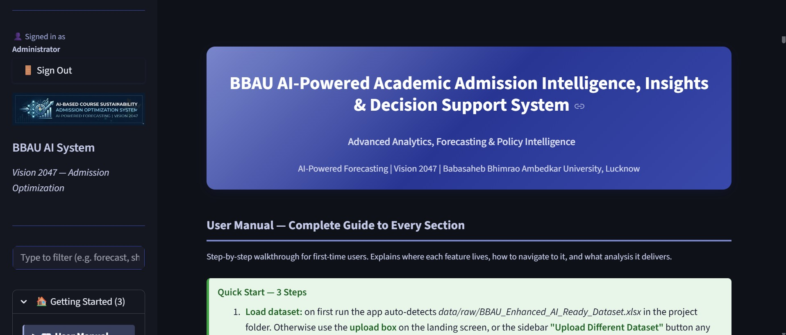
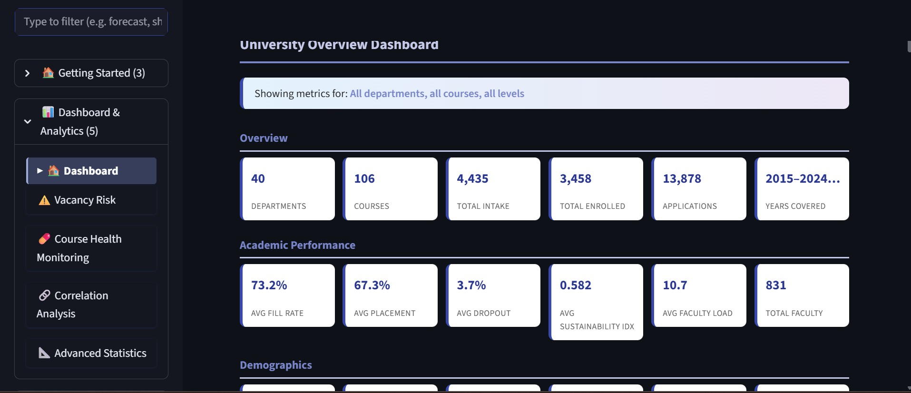
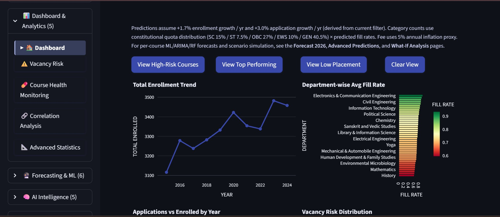
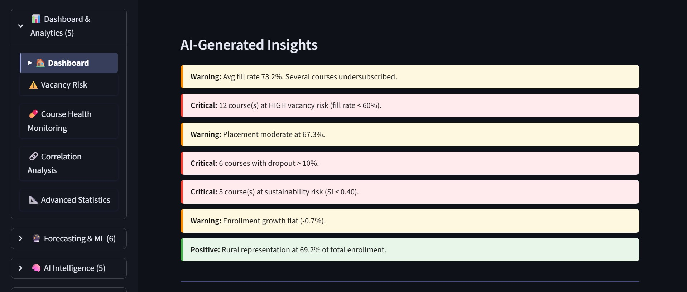
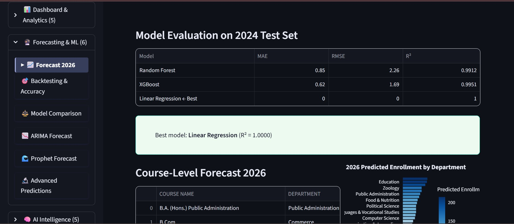
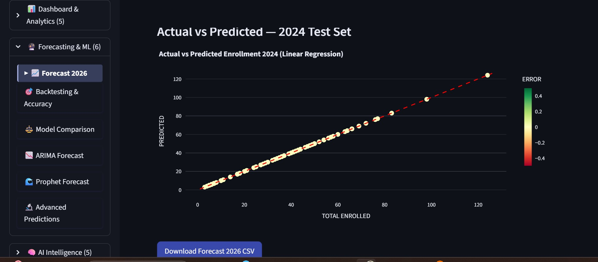
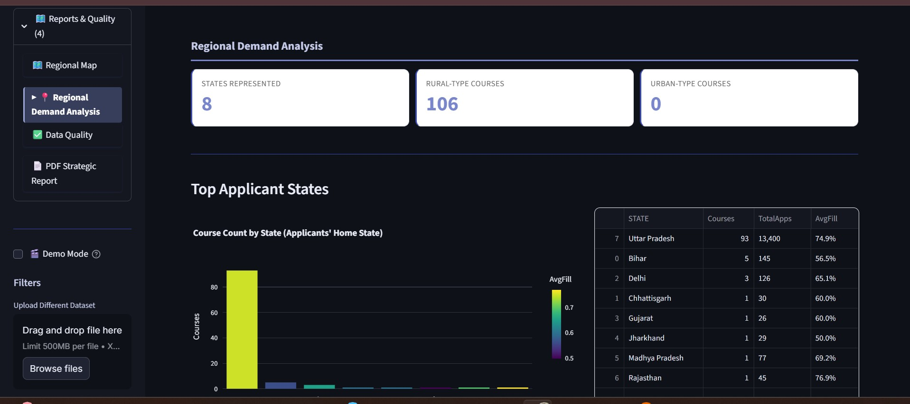
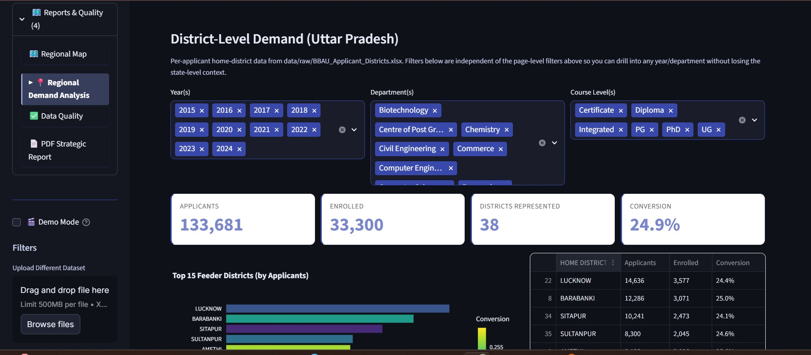
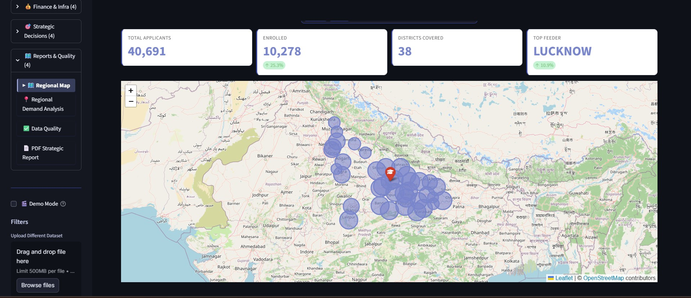
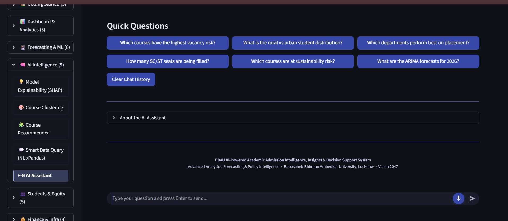

# 🎓 BBAU Academic Admission Intelligence

### AI-Powered Decision Support System for Course Sustainability and Admission Optimization


---

## 📖 Project Overview

BBAU Academic Admission Intelligence is an AI-powered decision support system developed as part of my M.Tech project at **Babasaheb Bhimrao Ambedkar University (BBAU), Lucknow**.

The system assists universities in forecasting admissions, analyzing course sustainability, monitoring vacancy risk, generating analytical reports, and supporting academic decision-making through machine learning and interactive dashboards.

> **Note:** This repository is a **project showcase** created for portfolio purposes. The complete source code and research implementation are maintained in a private repository.

---

---

# ✨ Key Features

- 🔐 **Secure Authentication**
  - User login and access control for authorized users.

- 📊 **Interactive Dashboard**
  - Real-time admission statistics and institutional KPIs.

- 📈 **Admission Forecasting**
  - Predicts future admissions using Machine Learning models.

- 🎯 **Course Sustainability Analysis**
  - Evaluates long-term viability of academic programs.

- ⚠️ **Vacancy Risk Assessment**
  - Identifies courses with potential admission shortfalls.

- 📚 **Academic Analytics**
  - Category-wise, department-wise, and course-wise analysis.

- 🌍 **Geographical Insights**
  - Visualizes student distribution across different regions.

- 📑 **Automated Report Generation**
  - Generates comprehensive analytical reports for decision-makers.

- 🤖 **AI Assistant**
  - Integrated AI assistant to answer project-related queries and provide guidance.

---


# 🛠️ Technology Stack

| Category | Technologies |
|-----------|--------------|
| **Programming Language** | Python 3.11 |
| **Framework** | Streamlit |
| **Machine Learning** | Scikit-learn |
| **Data Processing** | Pandas, NumPy |
| **Data Visualization** | Plotly |
| **Data Source** | Microsoft Excel (.xlsx) |
| **AI Assistant** | Google Gemini API, Anthropic Claude API |
| **Configuration** | TOML, Environment Variables |
| **Development Tools** | VS Code, Git, GitHub |
| **Version Control** | Git |

---


# 📸 Application Walkthrough

## 🔐 1. Secure Authentication


Users authenticate through a secure login interface before accessing the dashboard.

---

## 🏠 2. Home Page



The landing page provides an overview of the platform and quick navigation to major modules.

---

## 📊 3. Dashboard Overview



Displays institutional KPIs, admission insights, and overall analytics.

---

## 📂 4. Data Management



Allows users to manage admission datasets used for forecasting and analytics.

---

## 📈 5. Analytics Dashboard



Interactive charts and visualizations help analyze admission trends.

---

## 🔮 6. Forecast Input



Users configure forecasting parameters for predictive analysis.

---

## 📉 7. Forecast Results



Machine Learning models generate admission forecasts with visual insights.

---

## 📑 8. Reports Dashboard



Centralized report generation and analytical summaries.

---

## 📄 9. Report Export



Export analytical reports for institutional decision-making.

---

## 🌍 10. Geographical Analysis



Visual representation of regional admission patterns.

---

## 🤖 11. AI Assistant


Integrated AI assistant for guidance and intelligent interaction.

---

## 💬 12. AI Assistant Conversation



Supports interactive conversations using Google Gemini and Anthropic Claude.
```
```
# 🚀 Running the Project

> **Note:** This repository is a showcase version intended for portfolio demonstration.

The complete implementation is maintained in a private repository.

If access to the source code is required for academic evaluation or technical interviews, it can be shared upon request.

---

```
```
# 👨‍💻 Author

**G. Nitheesh Kumar**

M.Tech (Information Technology)

Babasaheb Bhimrao Ambedkar University (BBAU), Lucknow

GitHub: https://github.com/Nitheeshkumar-526

---

⭐ If you found this project interesting, consider giving this repository a star.
```
